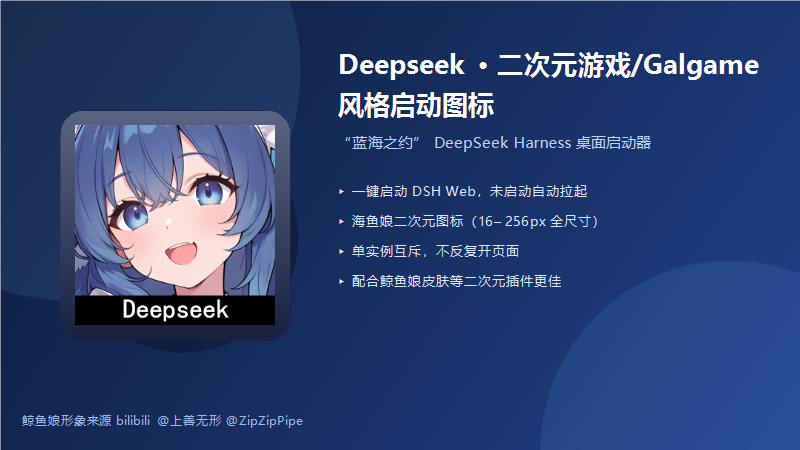

# Deepseek 二次元游戏/Galgame 风格启动图标「蓝海之约」



> **鲸鱼娘形象来源 bilibili @上善无形 @ZipZipPipe，适合重度二次元使用，配合鲸鱼娘皮肤等二次元插件使用更佳！**

一款 DeepSeek Harness（DSH）桌面启动器插件：装载后在桌面生成 **「蓝海之约」** 快捷方式，
一键启动/打开 DeepSeek Harness Web，图标为鲸鱼娘二次元立绘（16–256px 全尺寸透明底图标）。

- 🐋 **一键启动**：服务器未运行 → 自动 `npx --verbose @deepseek-ai/dsh web` 拉起（带 `--no-open`）；
  已运行 → 直接打开浏览器，绝不重复开页
- 🎯 **仪表盘级图标**：打包内多尺寸 ICO（16/24/32/48/64/128/256px），高分屏也清晰
- 🔒 **单实例互斥**：双击/重复点击只生效一次，不重复启动服务器、不重复开标签页
- ⏳ **就绪后打开**：轮询端口（最多 30 秒）确认服务真正可用后再打开浏览器
- 🎨 **高度定制**：快捷方式名、URL、端口均可通过插件配置修改

## 快速开始

```powershell
# 本地安装（仓库根目录执行）
dsh plugin --profile web add link:.\dsh-blue-sea-launcher

# 或直接使用 Releases 中的安装包 zip
dsh plugin --profile web add link:<解压后的 dsh-blue-sea-launcher 目录>
```

安装后**重启 `dsh web`**，桌面即出现「蓝海之约」。

## 效果预览

| 效果图 | 桌面快捷方式 |
| --- | --- |
|  | 带鲸鱼娘图标的一键启动入口 |

## 配置

在 profile 的 `cordis.patch.yml` 中覆盖默认值：

```yaml
- insert:
    - id: dsh-blue-sea-launcher
      name: dsh-blue-sea-launcher
      config:
        shortcutName: 蓝海之约        # 快捷方式名
        url: http://127.0.0.1:3080     # 打开地址
        port: 3080                     # 检活端口
```

## 卸载

```powershell
dsh plugin --profile web remove dsh-blue-sea-launcher
```

> 卸载不会删除已生成的桌面快捷方式（它先于 DSH 启动，是入口），手动删除即可。

## 常见问题

- **点一次开了两个页面**：v0.1.1 已修复——启动服务器时给 dsh web 传 `--no-open`，
  只由启动器打开一次。注意：若你自己在终端运行 `npx --verbose @deepseek-ai/dsh web`
  （不带 `--no-open`），DSH 会按原生行为自动开一次浏览器。
- **快捷方式没出现**：`dsh --profile web --dump-config | Select-String blue-sea` 应能看到该层；
  确认重启过 `dsh web`。
- **图标没变**：桌面按 F5 / 重启 explorer / 注销一次刷新图标缓存。

## 致谢

- 鲸鱼娘形象：bilibili @上善无形 @ZipZipPipe（署名保留，勿删除）
- 基于 [DeepSeek Harness](https://github.com/deepseek-ai/deepseek-harness) 插件体系开发

## License

MIT
